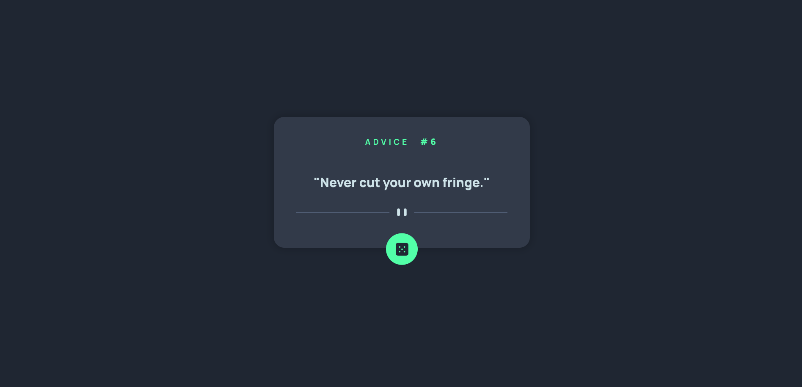

# Advice Generator App

A sleek, responsive web application that generates random pieces of advice using the Advice Slip API. Built with HTML, CSS, and vanilla JavaScript.



## Features

- Random advice generation with a single click
- Responsive design that works on both desktop and mobile devices
- Loading state indication with animated dots
- Error handling with user-friendly messages
- Clean and modern UI with smooth hover effects
- Automatic adjustment of divider image based on screen size

## Technologies Used

- HTML5
- CSS3
- Vanilla JavaScript
- [Advice Slip API](https://api.adviceslip.com/)
- Google Fonts (Manrope)

## Live Demo

[View Live Demo](https://chihaadam.github.io/advice-generator-app/)

## Setup and Installation

1. Clone the repository:
   ```bash
   git clone https://github.com/ChihaAdam/advice-generator-app.git
   ```

2. Navigate to the project directory:
   ```bash
   cd advice-generator-app
   ```

3. Open `index.html` in your preferred browser to run the application locally.

## Usage

- The app automatically generates a piece of advice when loaded
- Click the dice button to generate a new piece of advice
- The advice ID is displayed at the top of the card
- Loading state is indicated by animated dots
- Error messages are displayed in red if there's a connection issue

## Features in Detail

### Responsive Design
- Mobile-first approach
- Automatically switches between mobile and desktop divider images
- Responsive typography and spacing

### User Interface
- Hover effects on the dice button
- Disabled state styling during advice fetch
- Clean layout with proper spacing
- Color scheme:
  - Background: Dark Blue (hsl(218, 23%, 16%))
  - Advice Card: Dark Grayish Blue (hsl(217, 19%, 24%))
  - Text: Light Cyan (hsl(193, 38%, 86%))
  - Accent: Neon Green (hsl(150, 100%, 66%))

### Error Handling
- Timeout after 20 seconds
- User-friendly error messages
- Visual indication of errors with red text
- Console logging for debugging

## Development

### CSS Structure
- Uses CSS custom properties for colors
- Flexbox for layout
- Google Fonts integration
- Smooth transitions and hover effects

### JavaScript Features
- Async/await for API calls
- Error handling with try/catch
- Loading state management
- DOM manipulation
- Event listeners for user interaction
- Responsive image switching

## Contributing

1. Fork the repository
2. Create your feature branch (`git checkout -b feature/AmazingFeature`)
3. Commit your changes (`git commit -m 'Add some AmazingFeature'`)
4. Push to the branch (`git push origin feature/AmazingFeature`)
5. Open a Pull Request

## License

This project is licensed under the MIT License - see the [LICENSE.md](LICENSE.md) file for details.

## Acknowledgments

- [Frontend Mentor](https://www.frontendmentor.io/) for the project challenge
- [Advice Slip API](https://api.adviceslip.com/) for providing the advice data
- Google Fonts for the Manrope font family
